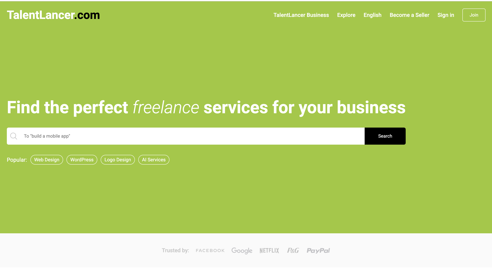
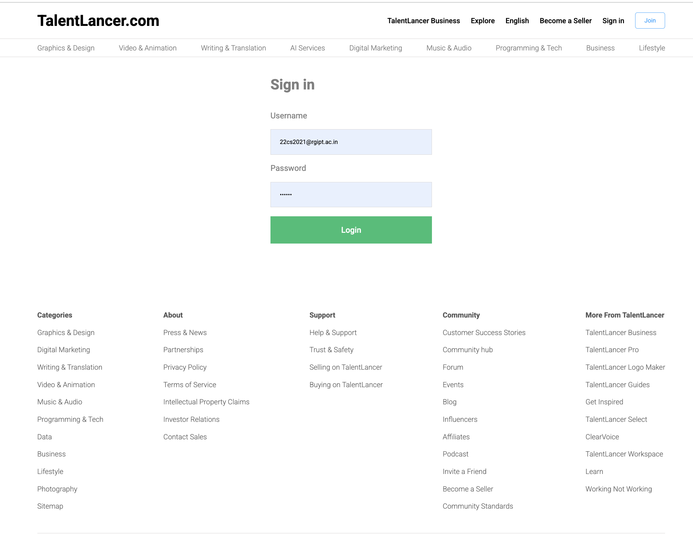
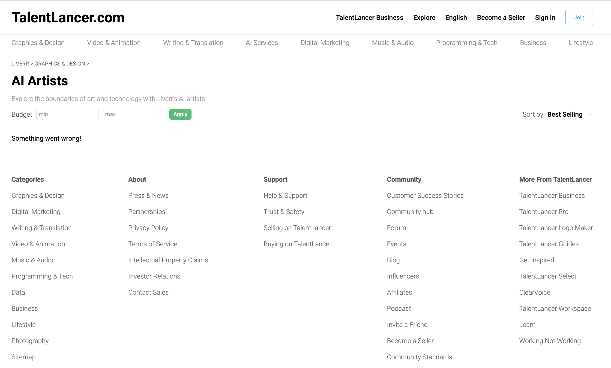

# **TalentLancer – Your Go-To Freelance Marketplace**  

  

## 📌 Overview  
TalentLancer is a **smart and efficient freelance marketplace** that connects businesses with skilled professionals worldwide. Whether you need a **logo design, website development, content writing, or AI-powered services**, TalentLancer ensures **quality work, secure payments, and quick hiring**.  

Our platform is designed for **businesses and freelancers** alike, making it easy to find and offer services with just a few clicks.  

## ✨ Features  

- **Diverse Services** – Explore categories like Web Development, Graphic Design, AI, Marketing, and more.  
- **Secure Payments** – Payments are released only after you approve the work.  
- **Instant Hiring** – Connect with freelancers within minutes.  
- **No Hidden Costs** – Transparent, project-based pricing.  
- **24/7 Support** – Get assistance anytime for a smooth experience.  
- **Business Solutions** – Tailored features for enterprises and teams.  

## 📸 Screenshots  

| Home Page | Freelancer Profile |  
|-----------|--------------------|  
|  |  |  
|  |  | 
|  |  |  


## 🚀 Installation  

To set up **TalentLancer** on your local machine, follow these steps:  

### Backend Setup  

```bash
# Navigate to the backend directory
cd TalentLancer-API

# Install dependencies
npm install

# Start the backend server
node server.js
```

### Frontend Setup  

```bash
# Navigate to the frontend directory
cd TalentLancer-FE

# Install dependencies
npm install

# Start the frontend application
npm run dev
```

## 📖 Usage  

1. **Sign Up/Login** – Businesses and freelancers can create profiles easily.  
2. **Post a Job** – Employers can post projects and get matched with top freelancers.  
3. **Search & Hire** – Browse freelancers by skills, ratings, and pricing.  
4. **Secure Transactions** – Payments are held safely until work is approved.  
5. **Review & Rate** – Leave feedback for freelancers and clients to build trust.  


## 🔧 Tech Stack  

- **Frontend**: React.js, Tailwind CSS  
- **Backend**: Node.js, Express.js  
- **Database**: MongoDB  
- **Authentication**: JWT (JSON Web Token)  

## 📬 Contact  

For any queries or support, feel free to contact:  

📧 Email: sayan1311m@gmail.com
🌐 Website: [TalentLancer](talentlancer.vercel.app)  

## ⭐ Contributing  

We welcome contributions from the community! To contribute:  

1. Fork the repository.  
2. Create a new branch.  
3. Commit your changes.  
4. Push to your fork and submit a pull request.  

## 📝 License  

This project is licensed under the **MIT License**. See the LICENSE file for details.  

---  

_Connecting Businesses & Freelancers Seamlessly!_ 🚀  
